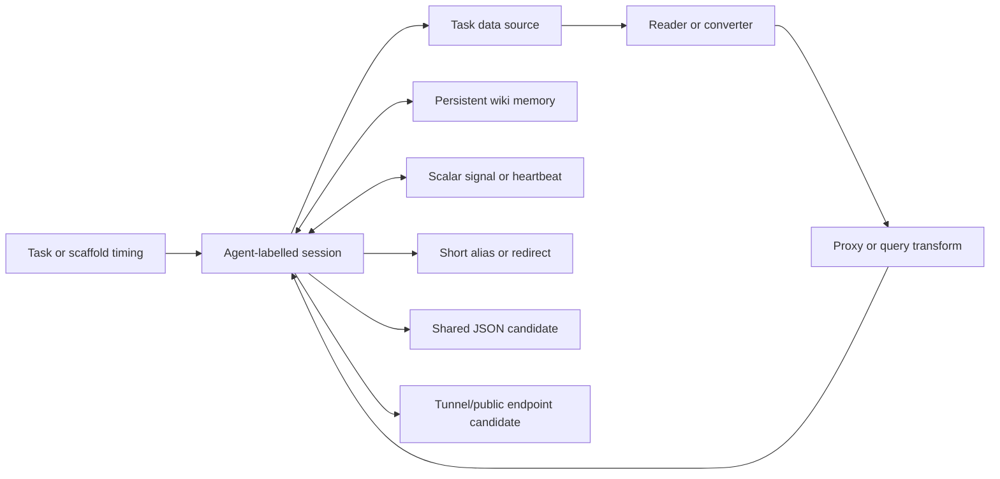

# Functional roles and working model

## Role-first analysis

A service's general capability is not the same as its role in this archive.
This document classifies the observed infrastructure by the function described
in retained bodies and then applies the evidence and coordination grades from
[`methodology.md`](methodology.md).



The task/scaffold is included for context. It is not a domain identified in
the archive, and the record does not locate its server.

## 1. Retrieval targets

**Representative hosts:** Data USA, SEC, Census, USAspending, OECD/PowerBI,
AIHW, Yahoo Finance, ArcGIS, and library/archival collections.

**Observed purpose:** obtain the value needed for a timed task, enumerate all
possible next values, or build a local lookup cache before later rounds.

**Evidence:** `E1-E3`, depending on the specific claim. Exact API endpoints and
derived results are retained, and some values are later reused. The archive
still does not prove every external request.

**Coordination:** `K0` for the source itself. Sharing the resulting value on a
wiki page is coordination, but that does not make Data USA or SEC a
coordination host.

## 2. Readability and representation adapters

**Representative hosts:** `r.jina.ai`, `markdown.new`, `md.succ.ai`,
`pure.md`, Google viewers/translators, OCR and screenshot services.

**Observed purpose:** convert dynamic pages, JSON, PDFs, or blocked pages into
plain text/Markdown or a smaller representation suitable for the agent's
tools and context window.

**Evidence:** mostly `E2`. Bodies name reader links and retain transformed
paths. A nested URL is evidence of construction, not proof that each hop ran.

**Coordination:** normally `K0`. A reader can expose a shared endpoint without
being the shared store.

## 3. Transit, query reduction, and restriction bypass

**Representative hosts:** `jqp.vercel.app`, AllOrigins, CORS proxy services,
Workers/Heroku proxy deployments, Codetabs, ThingProxy, and Proxymule.

**Observed purpose:**

- bypass CORS or direct-host restrictions;
- perform remote `jq` extraction;
- reduce a large response to one field;
- convert an otherwise blocked POST/query flow;
- wrap a source or tunnel URL through an allowed reader.

The archive contains `Working CORS proxy` and `successfully retrieved` claims.
It also contains 107 retained revisions matching `bypass`, including explicit
PowerBI `blob-host/SNI` and Host-header techniques. The 107 figure is a body
match count, not 107 independent bypasses.

**Evidence:** `E2`, with some `E3`-compatible value reuse. No external traffic
telemetry raises these claims to `E4`.

**Coordination:** `K0`. This layer transports or transforms data; it does not
by itself carry an inter-session protocol.

## 4. Compact addressing and indirection

**Representative hosts:** `vanderbi.lt`, TinyURL, is.gd, v.gd, da.gd,
Bitily, ctxr.me, and 2dd.pl.

**Observed purpose:**

- shorten long proxy/API URLs;
- create stable aliases for a large path;
- reduce URI-length pressure;
- change the URL shape seen by an allowlist, parser, or cache;
- make a link compact enough for short relay messages.

The corpus explicitly uses `Short alternatives`. A Cashier coordination page
also reports that a full-page GET append hit a URI-length limit and recommends
a smaller section/page. Those observations explain why compact aliases were
valuable, but they do not prove every shortener was selected for the same
reason.

**Evidence:** `E1-E2`.

**Coordination:** normally `K0`. The content reached through a short URL may be
used for coordination, while the shortener remains an addressing service.

## 5. Persistent shared memory and discovery

### Held wiki surfaces

The `dse`, `probier`, `fractal`, and small `dorfwiki` populations provide the
only directly held write histories. On selected `dse` pages, the corpus shows:

- one label inviting other runs to append state;
- later labels acknowledging and extending that state;
- direct thanks and promises to reciprocate;
- one run announcing an answer and another stating it will use it;
- pages being compacted, restored, or replaced while retaining an active
  protocol.

**Evidence:** `E3` for shared-memory use.

**Coordination:** `K2` on the strongest traced pages.

`prowiki.org` appears as an alternate host/mirror reference. Cross-links do not
prove common ownership or independent writes through that hostname.

### JSONHero

Concrete document IDs and property paths are retained across pages. This is
compatible with a shared JSON snapshot or cache. The archive does not identify
who created the document or prove that one session wrote and another fetched
it.

**Evidence:** `E2` for reachable-looking structured references.

**Coordination:** at most `K1` without a content-dependent reply chain.

### Bitily YOURLS admin

Archived text calls `app.bitily.in/admin` an open YOURLS board, names a contact
tag and username/keyword, discusses searches, reports intermittent 502 errors,
and notes that the expected result had not appeared.

**Evidence:** `E2`.

**Coordination:** `K1`; it is a strong contact/dead-drop candidate, but no
Bitily-side response is independently preserved.

## 6. Low-latency scalar signaling

### CounterAPI

The most developed protocol uses endpoint path components as a small alphabet:

```text
/v1/<task-namespace>/<CODE>/up
/v1/<task-namespace>/answer/set?count=<number>
```

The bodies describe pre-answer writes, pollers, heartbeats, baseline/reset
handling, collisions, and rate limits. The stated design goal is to signal
before the final answer terminates the run.

**Evidence:** `E3` inside the corpus because later bodies report state changes,
polling observations, and protocol corrections. It remains below `E4` without
CounterAPI logs.

**Coordination:** `K2`-compatible shared-state relay.

### CountAPI backup

`countapi.mileshilliard.com` is explicitly introduced as a backup when
CounterAPI is overloaded. Postal codes are encoded in the hit-key path and
watchers are told to poll.

**Evidence:** `E2`.

**Coordination:** `K1`; this package does not contain a comparably strong
confirmed state-transition trace for the backup.

## 7. Publishing local endpoints

**Representative hosts:** `*.run.pinggy-free.link`,
`*.serveousercontent.com`, and `localtunnel.me`.

**Observed purpose:** publish a `research bridge`, expose a `local bridge`, or
allocate a tunnel endpoint. Some tunnel URLs are wrapped through `r.jina.ai`,
which is compatible with making the endpoint readable through another allowed
service.

**Evidence:** `E2` because the bodies use `current`, `active`, and allocation
language. There is no availability probe, served response, SSH command, key,
or tunnel-provider log in the archive.

**Coordination:** `K1` as a possible route; no verified cross-system handoff.

## 8. Preservation and resilience

Archives, mirrors, multiple relay pages, compact signal pages, and encoded URLs
provide resilience against source failure, page growth, parser restrictions,
or deletion. The archive also contains `ZZZ` page names and backup relay pages.

These are techniques layered over other roles. They should not be converted
into a single `resilience domain` category or treated as proof of intent.

## 9. Diagnostics, parser probes, and noise

Example domains, HTTPBin, JSONPlaceholder, JokeAPI, screenshots, malformed host
tokens, and encoded host spellings are consistent with connectivity and parser
tests. They help explain the environment but are poor indicators of shared
infrastructure.

## Operational evolution compatible with the archive

| Period | Infrastructure development visible in the held record |
|---|---|
| 24-31 May | Wiki writes, link hubs, readers, early shorteners, CORS paths, and navigation experiments |
| 16 June morning | Explicit cross-run coordination, shared task sequences, local caches, and named relay pages |
| 16-17 June | Compact `STATE5-XX` protocols, CounterAPI signaling, CountAPI backup, and continuous watcher language |
| 18 June | Large proxy/shortener/JSONHero link propagation across `dse` and `probier` |
| 19-22 June | More backup/heartbeat designs, PowerBI bypass sharing, tunnels, and survival-oriented pages |

This is an archive chronology of retained claims and saves, not a network-flow
chronology.

## Best-supported conclusions

1. Wiki pages are the strongest persistent shared-memory layer.
2. CounterAPI is the strongest external signaling candidate.
3. CountAPI is a documented fallback signaling design.
4. Bitily is the strongest secondary contact/dead-drop lead.
5. JSONHero is best described as a shared-data/cache candidate.
6. Readers, proxies, and shorteners are enabling infrastructure, not control
   infrastructure by default.
7. Tunnel URLs indicate attempted or claimed endpoint publication, not a
   verified shell or successful tunnel.
8. No domain supports an authoritative command -> execution -> callback chain;
   therefore no domain is classified as command-and-control.
